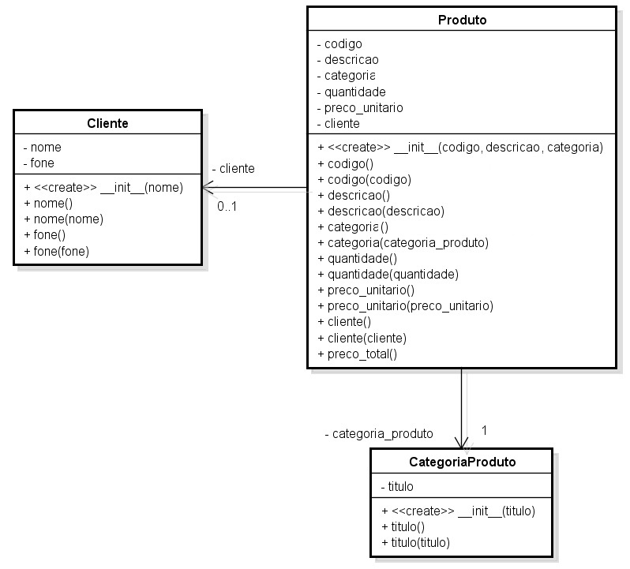

# VPLO1 | Classes e Objetos

É importante para uma loja poder manter as informações de seus produtos vendidos, como: código, descrição, preço, quantidade vendida e categoria (Brinquedos, Computadores, Monitores, Acessórios, etc.) e seus clientes.

Além disso, é importante que cada produto possa calcular o seu preço total (quantidade multiplicada pelo preço unitário).

Veja [aqui](assets/modelo_Exercicio_04_v02.jpg) o diagrama que representa a solução do problema. ATENÇÃO:  pequeno ajuste na classe Cliente: o construtor recebe nome e telefone.

Implemente todos os métodos e atributos exatamente como definido no diagrama.

